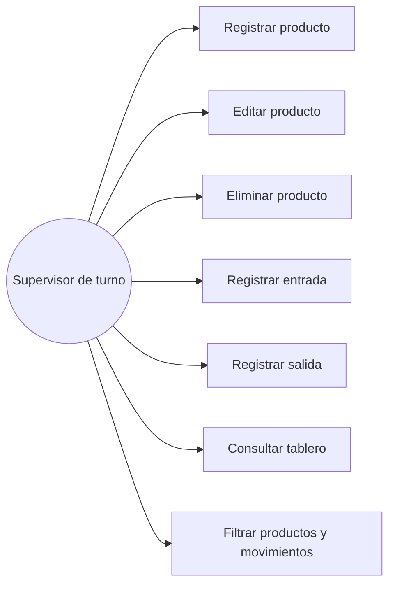

# 05. Casos de uso

El actor principal en todos los casos de uso es el **supervisor de turno**, que es quien interactúa con el sistema. No hay otros actores porque, como ya quedó claro en el alcance, esta versión no maneja distintos roles de usuario.

## UC01 — Registrar producto

- **Actor:** Supervisor de turno.
- **Precondiciones:** ninguna; es la primera vez que se registra este producto en el sistema.
- **Flujo principal:**
  1. El supervisor abre la pantalla de Productos.
  2. Completa el formulario con nombre, categoría, línea de producción, unidad de medida, stock mínimo y bodega.
  3. Confirma el registro.
  4. El sistema valida los datos y crea el producto con stock inicial en cero.
  5. El producto aparece en el listado.
- **Flujo alterno:** si falta el nombre, o la categoría/línea/unidad no corresponde a una de las opciones válidas, el sistema rechaza el registro y muestra el motivo.
- **Postcondición:** el producto queda disponible para recibir movimientos de entrada o salida.

## UC02 — Editar producto

- **Actor:** Supervisor de turno.
- **Precondiciones:** el producto ya existe en el sistema.
- **Flujo principal:**
  1. El supervisor selecciona el producto a editar.
  2. Modifica los campos editables (nombre, categoría, línea, unidad, stock mínimo, bodega).
  3. Confirma los cambios.
  4. El sistema valida y guarda la actualización.
- **Flujo alterno:** el sistema nunca permite editar el stock actual directamente desde este formulario; ese campo solo cambia a través de movimientos.
- **Postcondición:** el producto refleja los nuevos datos, con su stock actual sin alterar.

## UC03 — Eliminar producto

- **Actor:** Supervisor de turno.
- **Precondiciones:** el producto existe en el sistema.
- **Flujo principal:**
  1. El supervisor solicita eliminar un producto.
  2. El sistema confirma que no tiene movimientos asociados.
  3. El sistema elimina el producto.
- **Flujo alterno:** si el producto ya tiene movimientos registrados, el sistema rechaza la eliminación y explica que no se puede borrar un producto con historial, justamente para no perder trazabilidad.
- **Postcondición:** el producto deja de existir en el sistema (o, en el flujo alterno, permanece sin cambios).

## UC04 — Registrar entrada de inventario

- **Actor:** Supervisor de turno.
- **Precondiciones:** el producto existe en el sistema.
- **Flujo principal:**
  1. El supervisor abre la pantalla de Movimientos.
  2. Selecciona el producto, el tipo "Entrada", la cantidad y un motivo (por ejemplo, recepción de proveedor o lote de producción finalizado).
  3. Confirma el registro.
  4. El sistema suma la cantidad al stock actual del producto y guarda el movimiento.
- **Flujo alterno:** si falta el responsable, la cantidad es cero o negativa, o el producto no existe, el sistema rechaza el registro.
- **Postcondición:** el stock del producto aumenta y el movimiento queda visible en el historial.

## UC05 — Registrar salida de inventario

- **Actor:** Supervisor de turno.
- **Precondiciones:** el producto existe y tiene stock disponible.
- **Flujo principal:**
  1. El supervisor abre la pantalla de Movimientos.
  2. Selecciona el producto, el tipo "Salida", la cantidad y un motivo (consumo en producción, despacho a bodega central, etc.).
  3. Confirma el registro.
  4. El sistema verifica que la cantidad no supere el stock disponible, resta la cantidad del stock y guarda el movimiento.
- **Flujo alterno:** si la cantidad solicitada es mayor al stock disponible, el sistema rechaza la operación y explica cuánto hay realmente disponible — esta es, posiblemente, la regla más importante de todo el sistema, porque es la que evita que el inventario "mienta".
- **Postcondición:** el stock del producto disminuye y el movimiento queda visible en el historial.

## UC06 — Consultar tablero

- **Actor:** Supervisor de turno.
- **Precondiciones:** ninguna.
- **Flujo principal:**
  1. El supervisor abre la pantalla de Tablero.
  2. El sistema muestra los totales generales, los productos bajo el mínimo y los movimientos más recientes.
- **Flujo alterno:** no aplica; es una consulta de solo lectura.
- **Postcondición:** ninguna; no se modifica ningún dato.

## UC07 — Filtrar productos y movimientos

- **Actor:** Supervisor de turno.
- **Precondiciones:** existen productos o movimientos registrados.
- **Flujo principal:**
  1. El supervisor abre la pantalla de Productos o de Movimientos.
  2. Aplica un filtro disponible (categoría, línea, bajo mínimo, producto específico, tipo de movimiento).
  3. El sistema muestra solo los resultados que cumplen el filtro.
- **Flujo alterno:** si ningún registro cumple el filtro, el sistema simplemente muestra una lista vacía, sin error.
- **Postcondición:** ninguna; no se modifica ningún dato.
