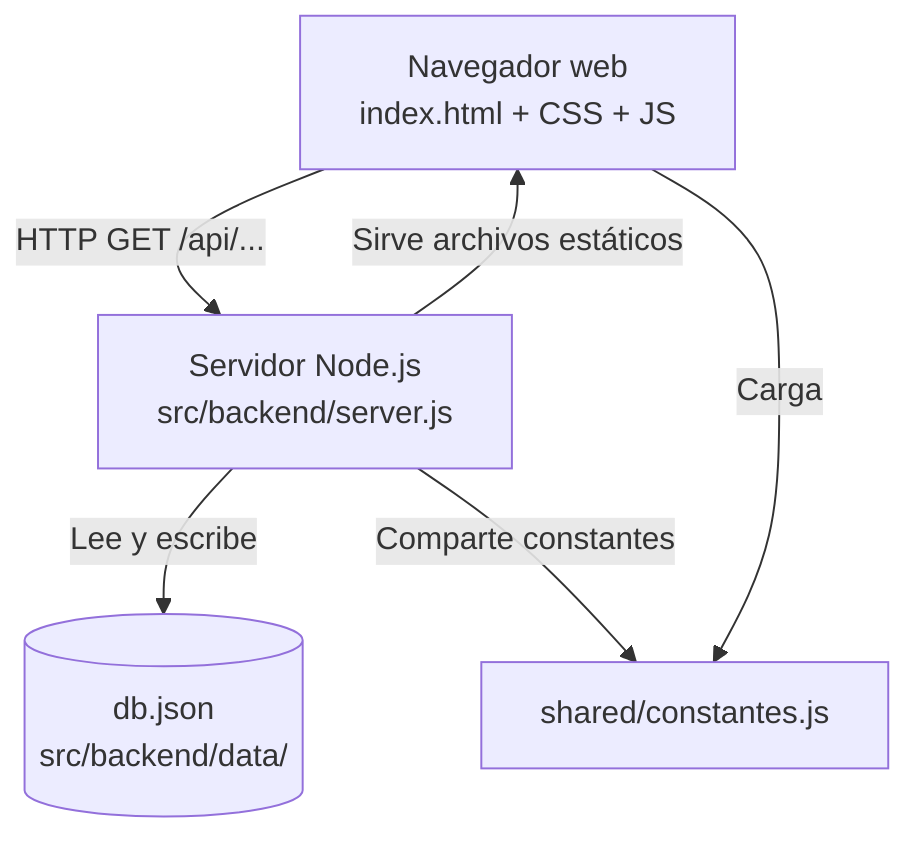

# 07. Arquitectura general

Voy a explicar cómo está organizado el sistema por dentro. No es una arquitectura compleja — y eso es intencional. La simplicidad fue una decisión, no una limitación por pereza.

---

## La idea general

El sistema sigue un modelo cliente-servidor clásico, pero con todo en el mismo repositorio y sin dependencias externas de base de datos. El servidor Node.js hace dos cosas al mismo tiempo: sirve los archivos estáticos del frontend Y expone una API REST para que ese frontend consuma los datos.



---

## Componentes principales

**Frontend** (`src/frontend/`)
Archivos HTML, CSS y JavaScript puros. Sin frameworks como React o Vue. Tres vistas que se muestran y ocultan con JS: tablero, productos y movimientos. Se carga una sola vez y luego se comunica con el backend vía `fetch()`.

**Backend** (`src/backend/`)
Un servidor HTTP construido con el módulo nativo de Node.js — sin Express, sin Fastify, sin nada externo. Maneja las rutas manualmente y persiste los datos en un archivo JSON.

**Shared** (`src/shared/`)
Un archivo de constantes (`constantes.js`) que tanto el frontend como el backend usan. Esto evita que los valores válidos (categorías, líneas, unidades) estén duplicados en dos lugares distintos.

**Datos** (`src/backend/data/db.json`)
El "almacén" del sistema. Un JSON con dos colecciones (`productos`, `movimientos`) y un objeto `meta` que lleva los contadores de IDs autoincrementales. No es una base de datos real — es un archivo de texto que el servidor lee y escribe con cada operación.

---

## Flujo de una operación típica

Cuando el supervisor registra una salida de producto:

1. El formulario del frontend llama a `API.registrarMovimiento(datos)`.
2. Eso dispara un `fetch('POST /api/movimientos', body)`.
3. El servidor recibe la petición, valida que el producto exista, que el tipo sea válido, que haya stock suficiente.
4. Si todo está bien, crea el movimiento, actualiza el `stockActual` del producto y guarda el `db.json` actualizado.
5. Devuelve el movimiento creado al frontend.
6. El frontend lo renderiza como un nuevo tiquete en la lista.

Si algo falla (stock insuficiente, producto inexistente), el servidor devuelve un error con código HTTP apropiado y un mensaje legible que el frontend muestra al usuario.

---

## Por qué no usé frameworks ni base de datos real

Tres razones concretas:

1. **Portabilidad.** El proyecto corre con `node server.js` en cualquier computadora que tenga Node instalado. No hay que instalar paquetes, no hay que configurar un motor de base de datos, no hay que crear schemas.

2. **Transparencia académica.** Al no usar Express ni ninguna librería de routing, el código del servidor es más explícito. Se ve cómo funciona HTTP por debajo, no hay "magia".

3. **Escala adecuada al problema.** Para un supervisor de un solo turno haciendo registros uno a uno, no se necesita un sistema que soporte miles de usuarios simultáneos. El JSON es suficiente.

---

## Evolución futura (fase 2)

Si este sistema fuera a crecer y usarse en producción real, la arquitectura natural sería:

- Reemplazar el JSON por **SQLite** (si sigue siendo un solo servidor) o **PostgreSQL** (si se escala a varios usuarios).
- Agregar **Express** o **Fastify** para manejar el routing de forma más limpia.
- Implementar **autenticación JWT** para distinguir roles (supervisor, jefe de bodega, gerente).
- Desplegar en un servidor (un VPS, Railway, o similar) para que no dependa de que la computadora del supervisor esté prendida.

Pero eso es fase 2. Esta versión ya resuelve el problema real que me motivó a construirla.

---

## Estructura de carpetas

```
galletas-puig-inventario/
├── src/
│   ├── frontend/
│   │   ├── index.html          ← La única página HTML del sistema
│   │   ├── css/styles.css      ← Toda la estética
│   │   └── js/
│   │       ├── api.js          ← Capa de comunicación con el backend
│   │       ├── utils.js        ← Funciones compartidas (fechas, tiquetes)
│   │       ├── dashboard.js    ← Lógica del tablero resumen
│   │       ├── productos.js    ← Lógica de la vista de productos
│   │       ├── movimientos.js  ← Lógica de la vista de movimientos
│   │       └── app.js          ← Inicialización y navegación entre vistas
│   ├── backend/
│   │   ├── server.js           ← El servidor HTTP con todas las rutas
│   │   ├── db.js               ← Funciones para leer y escribir el JSON
│   │   ├── package.json        ← Metadata del proyecto Node
│   │   └── data/db.json        ← La base de datos del sistema
│   └── shared/
│       └── constantes.js       ← Valores válidos compartidos frontend/backend
├── docs/                       ← Toda la documentación (aquí estás)
├── ai/                         ← Rules, Agents y Prompts de IA
└── deliverables/               ← Evidencias y release notes
```
