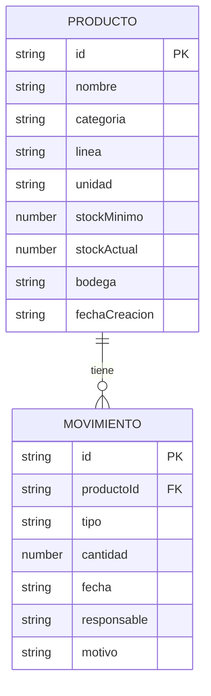

# 10. Modelo de datos

El sistema maneja dos entidades principales: **Producto** y **Movimiento**. Acá están descritas con todos sus campos, tipos y la relación entre ellas.

---

## Entidad: Producto

Representa cualquier ítem del inventario — ya sea materia prima (harina, azúcar, bolsas) o producto terminado (galletas empacadas listas para distribución).

| Campo | Tipo | Obligatorio | Descripción |
|-------|------|-------------|-------------|
| `id` | `string` | Sí (auto) | Identificador único. Formato `"P01"`, `"P02"`, etc. Autogenerado por el servidor. |
| `nombre` | `string` | Sí | Nombre del producto. Ej: `"Harina de trigo"`, `"Galleta de Avena x200g"`. |
| `categoria` | `string` | Sí | Valores válidos: `"Materia Prima"` o `"Producto Terminado"`. |
| `linea` | `string` | Sí | A qué línea pertenece. Valores: `"General"`, `"Línea Avena"`, `"Línea Wafer"`, `"Línea Soda"`, `"Línea Chocolate"`. |
| `unidad` | `string` | Sí | Unidad de medida. Valores: `"kg"`, `"g"`, `"L"`, `"ml"`, `"unidades"`. |
| `stockMinimo` | `number` | Sí | Cantidad mínima deseable. Si `stockActual` cae por debajo, se activa la alerta. |
| `stockActual` | `number` | Sí (auto) | Stock real en este momento. Se inicializa en `0` al crear el producto y **solo se actualiza mediante movimientos**. |
| `bodega` | `string` | No | Descripción libre de dónde está almacenado (ej: `"Bodega principal"`, `"Cuarto frío"`). |
| `fechaCreacion` | `string` | Sí (auto) | Fecha ISO 8601 del momento en que se registró el producto. Generada automáticamente por el servidor. |

---

## Entidad: Movimiento

Representa cada entrada o salida de stock. Es el registro histórico de todo lo que ha pasado con el inventario.

| Campo | Tipo | Obligatorio | Descripción |
|-------|------|-------------|-------------|
| `id` | `string` | Sí (auto) | Identificador único. Formato `"M01"`, `"M02"`, etc. Autogenerado por el servidor. |
| `productoId` | `string` | Sí | Referencia al `id` del producto que se mueve. Clave foránea. |
| `tipo` | `string` | Sí | Valores válidos: `"entrada"` o `"salida"`. |
| `cantidad` | `number` | Sí | Cantidad movida. Siempre positiva y mayor a cero. |
| `fecha` | `string` | Sí (auto) | Fecha y hora ISO 8601 del movimiento. Generada automáticamente por el servidor al recibir la petición. |
| `responsable` | `string` | Sí | Nombre de quien registró el movimiento. No puede quedar vacío. |
| `motivo` | `string` | No | Descripción opcional del motivo (ej: `"Recepción de proveedor"`, `"Despacho turno mañana"`). |

---

## Relación entre entidades



Un producto puede tener muchos movimientos. Cada movimiento pertenece a exactamente un producto. Si se intenta borrar un producto que ya tiene movimientos, el sistema lo rechaza para proteger la integridad del historial.

---

## El objeto `meta`

Dentro del `db.json` hay un objeto especial llamado `meta` que no es una entidad de negocio sino infraestructura del sistema:

```json
{
  "meta": {
    "siguienteIdProducto": 14,
    "siguienteIdMovimiento": 25
  }
}
```

Estos contadores garantizan que los IDs nunca se repiten, ni siquiera si se borra un producto o movimiento. El servidor los incrementa en cada creación y los guarda junto con el resto de los datos.

---

## Ejemplo de registro en `db.json`

```json
{
  "productos": [
    {
      "id": "P01",
      "nombre": "Harina de trigo",
      "categoria": "Materia Prima",
      "linea": "General",
      "unidad": "kg",
      "stockMinimo": 500,
      "stockActual": 720,
      "bodega": "Bodega principal",
      "fechaCreacion": "2026-05-20T08:00:00.000Z"
    }
  ],
  "movimientos": [
    {
      "id": "M01",
      "productoId": "P01",
      "tipo": "entrada",
      "cantidad": 1000,
      "fecha": "2026-05-26T07:30:00.000Z",
      "responsable": "Andrés Martínez",
      "motivo": "Recepción de proveedor semanal"
    }
  ],
  "meta": {
    "siguienteIdProducto": 14,
    "siguienteIdMovimiento": 25
  }
}
```
