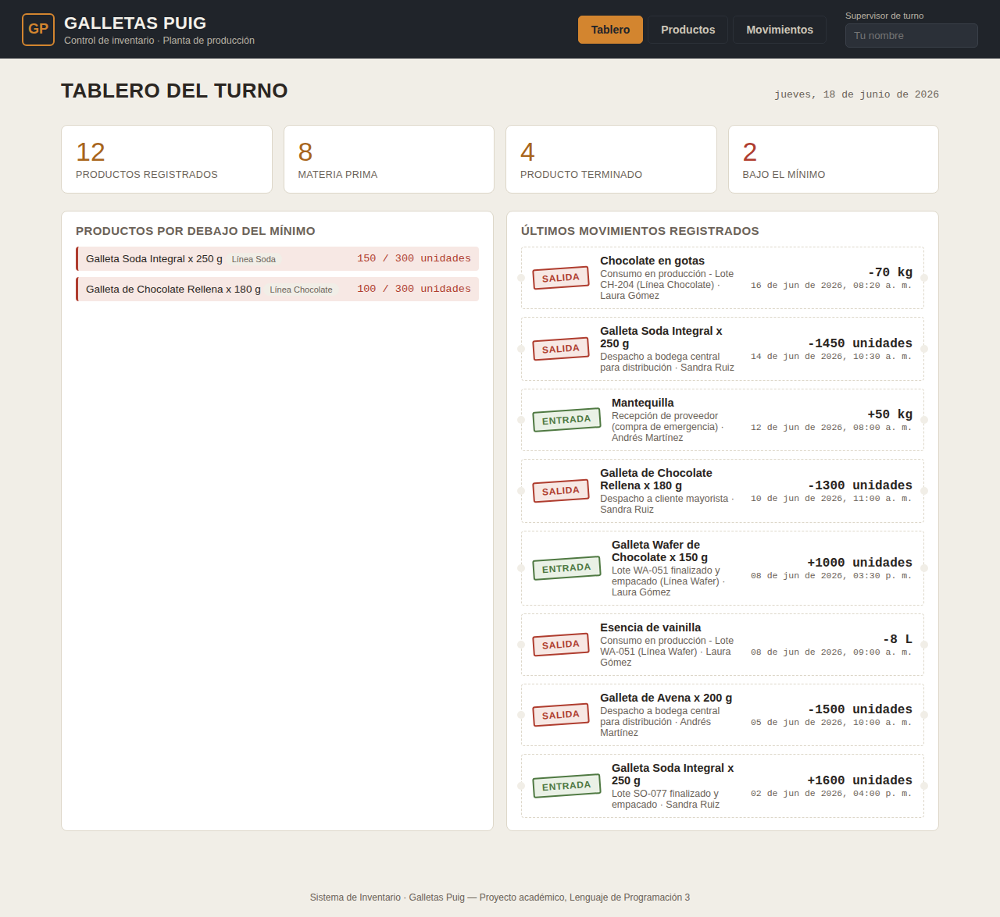
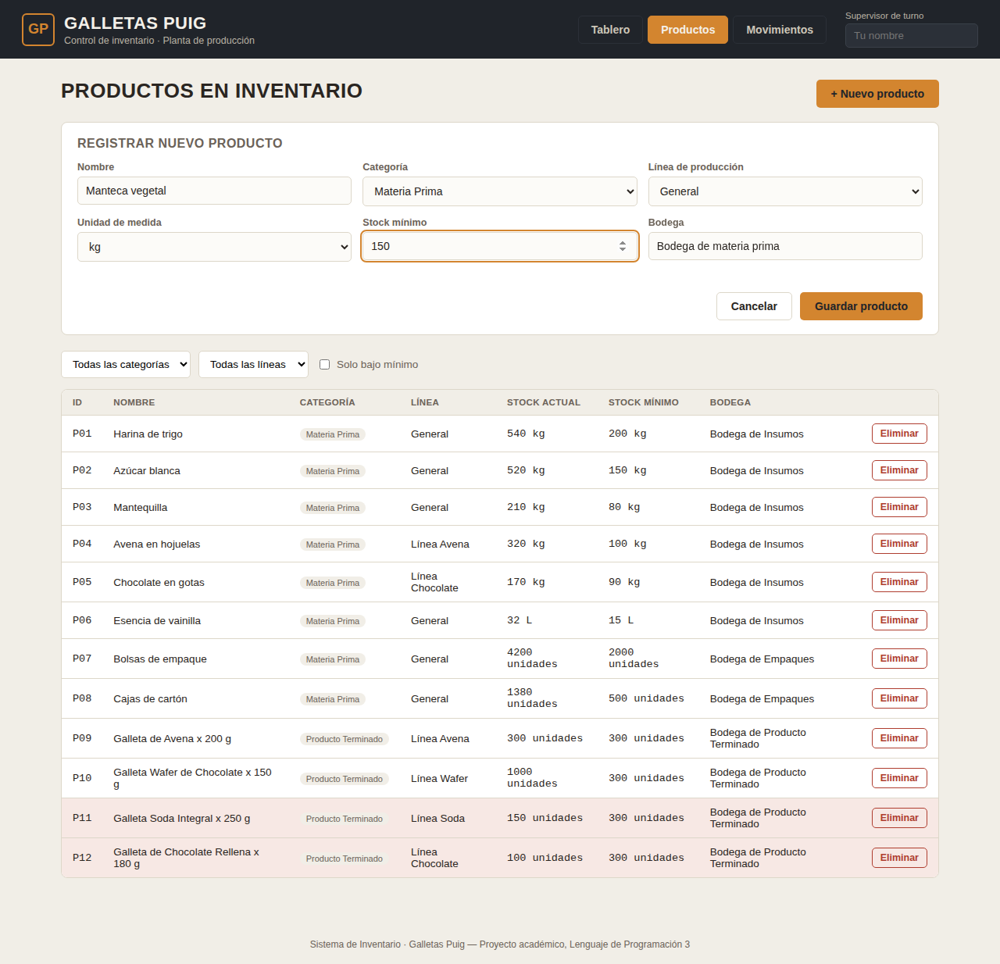
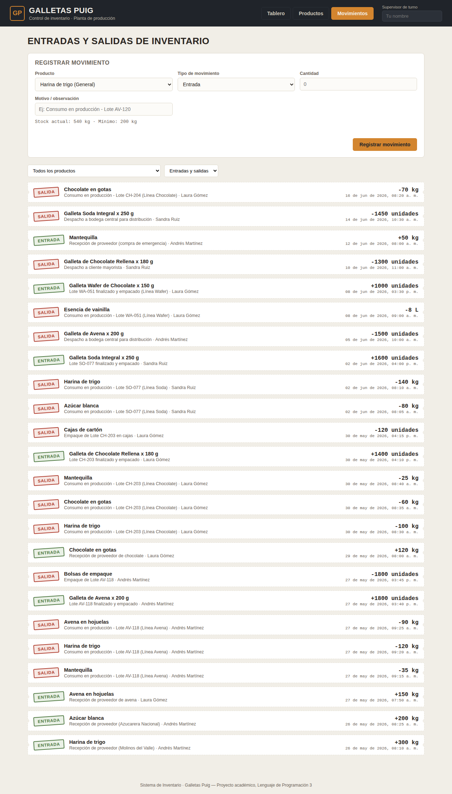

# 14. Manual de usuario

Este manual es para el supervisor de turno. No asume ningún conocimiento técnico — solo que sabe usar un navegador web.

---

## Antes de empezar

Para abrir la app, alguien con acceso técnico tiene que haber iniciado el servidor. Una vez que el servidor está corriendo, abrís en el navegador:

```
http://localhost:3000
```

Eso es todo. La app carga y ya podés trabajar.

---

## La pantalla principal

Lo primero que ves al entrar es el **Tablero**. Arriba a la derecha aparece la fecha de hoy y un campo que dice "Supervisor de turno". Escribí tu nombre ahí — se va a guardar automáticamente y va a aparecer como responsable cuando registrés movimientos.



El tablero muestra cuatro tarjetas de resumen:
- **Total de productos** registrados en el sistema.
- **Materias primas** (harina, azúcar, empaques, etc.).
- **Productos terminados** (galletas listas para despacho).
- **Alertas de stock** — cuántos productos están por debajo de su mínimo.

Debajo de las tarjetas hay dos listas:
- **Productos bajo mínimo:** los que necesitan reposición urgente.
- **Últimos movimientos:** las entradas y salidas más recientes.

---

## Ver y gestionar productos

Hacé clic en la pestaña **"Productos"** del menú superior.


Acá aparece la lista completa de todos los productos. Las filas resaltadas en ámbar son los que tienen el stock por debajo del mínimo — poneles atención primero.

**Filtros disponibles:**
- Por categoría (Materia Prima / Producto Terminado).
- Por línea de producción.
- Mostrar solo los que están bajo mínimo.

### Registrar un nuevo producto

Hacé clic en **"+ Nuevo producto"**. Aparece un formulario:



Completá los campos:
- **Nombre:** como quieras que aparezca en los listados.
- **Categoría:** Materia Prima o Producto Terminado.
- **Línea de producción:** a qué línea pertenece.
- **Unidad de medida:** kg, litros, unidades, etc.
- **Stock mínimo:** la cantidad por debajo de la cual querés recibir la alerta. Pensalo como "nunca debería haber menos de X de esto".
- **Bodega (opcional):** dónde está guardado físicamente.

Hacé clic en **"Guardar"**. El producto queda registrado con stock 0 — el stock solo sube cuando registrás una entrada.

### Eliminar un producto

Solo se puede eliminar un producto si **nunca tuvo movimientos**. Si ya tiene historial de entradas o salidas, el sistema no lo deja borrar — eso es intencional, para que los registros queden completos.

---

## Registrar entradas y salidas

Hacé clic en la pestaña **"Movimientos"**.



Arriba está el formulario para registrar. Abajo está el historial de todo lo que ha pasado.

### Cómo registrar una entrada (llegó mercancía o producto)

1. Seleccioná el producto de la lista desplegable. Al seleccionarlo, aparece el stock actual.
2. Elegí tipo **"Entrada"**.
3. Escribí la cantidad que ingresó.
4. El campo "Responsable" se llena automáticamente con tu nombre si lo escribiste en el encabezado, pero podés cambiarlo.
5. Agregá un motivo si querés (ej: "Recepción proveedor", "Producción turno tarde").
6. Hacé clic en **"Registrar movimiento"**.

El stock del producto se actualiza automáticamente.

### Cómo registrar una salida (se usó o se despachó)

Igual que la entrada, pero elegís tipo **"Salida"**.

> ⚠️ **Importante:** Si la cantidad que querés retirar es mayor al stock disponible, el sistema te avisa y no registra la salida. Verificá el stock antes de registrar.

### Ver el historial

Debajo del formulario está el historial completo. Cada movimiento aparece como un tiquete con:
- El nombre del producto.
- Si fue entrada o salida (con el sello verde o rojo).
- La cantidad y unidad.
- Quién lo registró y cuándo.
- El motivo, si se escribió.

Podés filtrar el historial por producto o por tipo de movimiento.

---

## Preguntas frecuentes

**¿Qué pasa si me equivoco en una cantidad?**
Por ahora no hay forma de editar un movimiento ya registrado. Si cometiste un error en una entrada, podés compensarlo registrando una salida por la misma cantidad (o viceversa), y en el motivo aclarás que es una corrección.

**¿Puedo usar la app desde mi celular?**
Sí, funciona en navegadores móviles. Está pensada principalmente para usar en computadora, pero si necesitás revisarla desde el teléfono se adapta razonablemente bien.

**¿Los datos se pierden si se reinicia el servidor?**
No. Todo queda guardado en disco automáticamente. Al reiniciar, el servidor carga los datos del último estado guardado.
